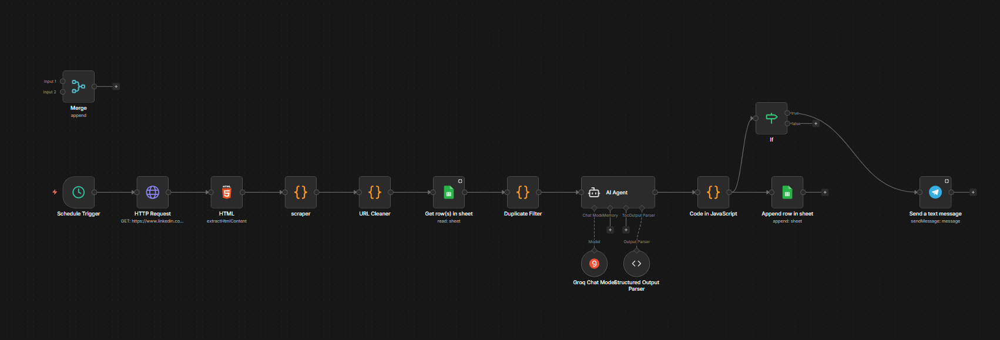
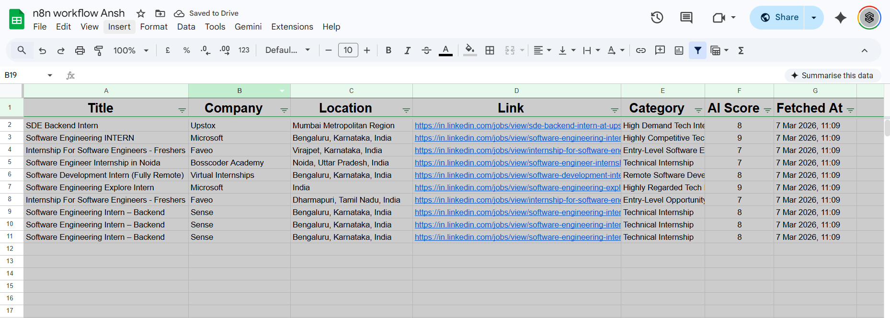

# 🚀 n8n Job Automation Workflow (AI-Based Internship Monitor)

## 🧠 Overview

This project automates internship discovery using **n8n, AI, and web scraping**.

It collects internship listings from LinkedIn, processes the data, evaluates each role using AI, filters duplicates, stores results in Google Sheets, and sends real-time alerts via Telegram.

---

## 💡 Problem Solved

Manually searching for internships is repetitive and inefficient.
This system automates discovery, filtering, and evaluation using AI — saving time and improving decision-making.

---

## ⚙️ Features

* 🔍 Scrapes internships from LinkedIn
* 📊 Extracts title, company, location, and link
* 🧹 Cleans and normalizes job data
* 🤖 Uses Google Gemini AI to analyze internships
* ⭐ Assigns AI Score, Category, and Summary
* 🚫 Filters duplicate entries using Google Sheets
* 📁 Stores structured data automatically
* 📩 Sends Telegram alerts for relevant jobs
* 🐳 Runs inside Docker containers

---

## 🧩 Workflow Pipeline

1. Scrape internship listings from LinkedIn
2. Extract job data (title, company, location, link)
3. Clean and normalize URLs
4. Process internships using AI (Google Gemini)
5. Generate:

   * Category
   * AI Score
   * Summary
6. Check for duplicates in Google Sheets
7. Append only new internships
8. Send Telegram notifications for high-quality roles

---

## 🤖 AI Processing

The system uses **Google Gemini** to evaluate internships based on:

* Role relevance (Software Engineering focus)
* Company quality
* Location suitability
* Job description context

Each internship is scored and summarized automatically.

---

## 🛠 Tech Stack

* n8n (Workflow Automation)
* JavaScript (Data Processing)
* Google Gemini API (AI Analysis)
* Google Sheets API (Storage & Deduplication)
* Telegram Bot API (Notifications)
* Docker (Containerization)
* PowerShell (Environment Setup & Execution)

---

## 📸 Demo

### 🔄 Workflow (n8n)

### 📊 Google Sheets Output

---

## 📌 How to Use

1. Import `workflow.json` into n8n
2. Configure credentials:

   * Google Sheets API
   * Telegram Bot API
   * Google Gemini API
3. Run the workflow manually or via scheduler

---

## 🧠 Key Highlights

* Prevents duplicate internship entries
* Uses AI to prioritize high-quality opportunities
* Fully automated pipeline (no manual intervention required)
* Easily extendable for other job roles

---

## 🚀 Future Improvements

* Add job description scraping for deeper analysis
* Improve AI scoring accuracy
* Deploy as a hosted automation service
* Add dashboard for analytics

---
